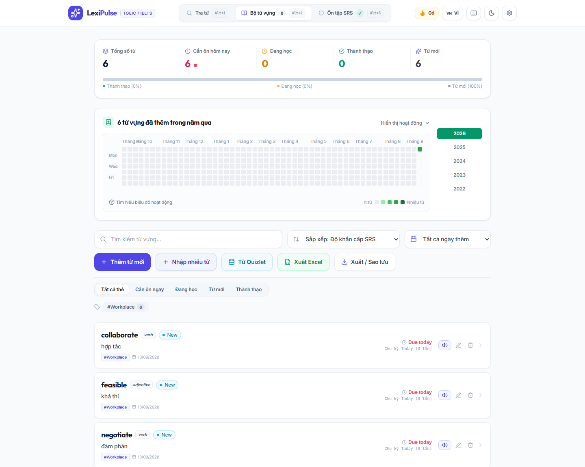

# LexiPulse

Ứng dụng học từ vựng Anh–Việt với tra cứu đa nguồn, nhập Quizlet và ôn tập lặp lại ngắt quãng bằng FSRS. Dữ liệu học tập được lưu trong trình duyệt, không cần tạo tài khoản LexiPulse.

*A local-first English–Vietnamese vocabulary app with dictionary lookup, optional AI enrichment, Quizlet import, and spaced repetition.*

[](https://github.com/lnb2x/lexipulse/actions/workflows/ci.yml)
[](LICENSE)
[](package.json)
[](package.json)



*Ảnh chụp phiên bản 0.1.0 với dữ liệu minh họa trong trình duyệt riêng.*

## Bắt đầu nhanh

**Yêu cầu:** Git, npm và Node.js **22.18+ thuộc nhánh 22**, **24+ thuộc nhánh 24**, hoặc **26+**. File [.nvmrc](.nvmrc) chọn Node 22 để khớp CI. Trình duyệt cần hỗ trợ IndexedDB.

```sh
git clone https://github.com/lnb2x/lexipulse.git
cd lexipulse
npm ci
npm run dev
```

Mở địa chỉ in trong terminal, mặc định là `http://localhost:5173`. Chưa cần API key để tra cứu từ điển và quản lý bộ từ.

Để nhập trực tiếp bằng **URL Quizlet**, cài thêm Chromium:

```sh
npx playwright install chromium
```

Vite đã tích hợp endpoint dịch và nhập Quizlet khi chạy `dev` hoặc `preview`; không cần mở backend riêng trong quy trình này. Nếu Quizlet yêu cầu đăng nhập hoặc chặn truy cập, dùng chức năng dán văn bản export.

## Tính năng

| Chức năng | Khả năng hiện có |
| --- | --- |
| Tra cứu Anh–Việt | Định nghĩa, IPA, ví dụ, collocations, họ từ và gợi ý từ nguyên mẫu; kết hợp dữ liệu cục bộ, cache và nguồn trực tuyến. |
| AI tùy chọn | Cấu hình provider, model và endpoint; bổ sung nghĩa, ví dụ và hình thái học, có ghi nhận nguồn dữ liệu. |
| Ôn tập FSRS | Flashcard, điền từ, nghe chép chính tả, trắc nghiệm và nối từ; lưu lịch sử cùng lịch ôn tiếp theo. |
| Nghe và phím tắt | Phát âm US/UK, điều chỉnh tốc độ, nghe lặp trên flashcard và bảng phím tắt trong ứng dụng. |
| Quản lý bộ từ | Tìm kiếm, lọc, tag, chỉnh sửa, thống kê học tập và biểu đồ hoạt động theo ngày. |
| Nhập Quizlet | URL hoặc văn bản export, xem trước, chuẩn hóa thẻ, xử lý từ trùng và theo dõi liên kết với bộ gốc. |
| Nhập/xuất | Văn bản, CSV, Excel và backup JSON chứa từ vựng, cài đặt đã bỏ API key và thống kê ngày. |
| Giao diện | Tiếng Việt/tiếng Anh, sáng/tối, bố cục đáp ứng và hỗ trợ giảm chuyển động. |

## Luồng sử dụng

1. **Tra cứu:** nhập từ hoặc cụm từ, kiểm tra nghĩa rồi lưu.
2. **Bộ từ vựng:** chỉnh sửa, gắn tag hoặc nhập thêm qua Quizlet, văn bản hay tệp.
3. **Ôn tập:** chọn chế độ; với flashcard, đánh giá mức nhớ để cập nhật lịch FSRS.
4. **Sao lưu:** xuất JSON định kỳ, đặc biệt trước khi đổi trình duyệt hoặc xóa dữ liệu trang web.

Chi tiết về AI, Quizlet và sao lưu: [Hướng dẫn sử dụng](docs/usage.md).

## Cấu hình AI và quyền riêng tư

Mở **Cài đặt**, chọn provider, nhập API key nếu cần và kiểm tra kết nối. Ứng dụng có các lựa chọn Gemini, OpenAI, Anthropic, DeepSeek, Groq, OpenRouter và endpoint tương thích OpenAI cho mô hình cục bộ.

Model khả dụng, quyền truy cập và khả năng gọi từ trình duyệt phụ thuộc provider. Chọn model tài khoản của bạn được phép sử dụng; tên gợi ý trong giao diện không bảo đảm model còn khả dụng.

API key mặc định được giữ trong `sessionStorage`. Nếu bật ghi nhớ lâu dài, key được lưu trong IndexedDB trên máy. Đây là bộ nhớ trình duyệt, **không phải kho bí mật được mã hóa**. AI gửi nội dung cần xử lý đến endpoint bạn cấu hình; dịch và tra cứu trực tuyến cũng gửi truy vấn đến nguồn tương ứng.

## Phát triển và kiểm tra

| Lệnh | Công dụng |
| --- | --- |
| `npm run dev` | Chạy giao diện và middleware API cục bộ. |
| `npm run lint` | Kiểm tra mã bằng Oxlint. |
| `npm run typecheck` | Kiểm tra kiểu TypeScript của ứng dụng và server. |
| `npm test` | Chạy unit test và regression test bằng Vitest. |
| `npm run build` | Kiểm tra kiểu và tạo bản build trong `dist/`. |
| `npm run preview` | Xem thử bản build cục bộ. |
| `npm run test:e2e` | Kiểm thử trình duyệt; cần build và cài Chromium trước. |
| `npm run check` | Chạy lint, typecheck, unit test và build tuần tự. |
| `npm run server` | Chạy backend riêng, mặc định cổng `3001`. |

```sh
npm run check
npx playwright install chromium
npm run test:e2e
```

CI chạy các bước kiểm tra trên push vào `main` và pull request. Xem kết quả thực tế tại [GitHub Actions](https://github.com/lnb2x/lexipulse/actions).

## Cấu trúc dự án

```text
lexipulse/
├── .github/              # CI, issue forms và mẫu pull request
├── docs/                 # Sử dụng, kiến trúc và triển khai
├── e2e/                  # Kiểm thử trình duyệt
├── public/               # Manifest, service worker và biểu tượng
├── server/               # Backend tùy chọn và bộ đọc Quizlet
├── src/
│   ├── components/       # Giao diện common, lookup, deck, review
│   ├── features/         # Màn hình tra cứu, bộ từ và ôn tập
│   ├── hooks/            # Từ vựng, lịch ôn và trợ năng
│   ├── i18n/             # Nội dung tiếng Việt/tiếng Anh
│   ├── services/         # Từ điển, AI, FSRS, IndexedDB và Quizlet
│   ├── types/            # Mô hình dữ liệu
│   └── utils/            # Văn bản, ngày tháng và nhập liệu
└── tests/                # Unit, integration và regression tests
```

Nền tảng: React, TypeScript, Vite, Tailwind CSS, Dexie/IndexedDB, `ts-fsrs`, Vitest và Playwright. Phiên bản chính xác nằm trong [package-lock.json](package-lock.json).

## Triển khai và giới hạn

- `dist/` là frontend tĩnh. Middleware Vite **không nằm trong bản build**; nhập Quizlet bằng URL cần backend cùng origin hoặc reverse proxy.
- `npm run preview` dùng để kiểm tra cục bộ. Xem [hướng dẫn triển khai](docs/deployment.md) khi dùng máy chủ riêng.
- Dữ liệu gắn với trình duyệt, hồ sơ và origin; chưa có đồng bộ tài khoản giữa thiết bị.
- Service worker hỗ trợ dùng lại tài nguyên đã cache. Tra cứu mới qua mạng, AI từ xa và nhập URL vẫn cần kết nối; màn hình chưa tải có thể chưa dùng được offline.
- Backup hiện chưa chứa bảng quản lý bộ Quizlet riêng. Từ đã nhập vẫn được xuất trong bộ từ; giữ export Quizlet gốc nếu cần khôi phục danh sách bộ.
- Chất lượng nội dung phụ thuộc nguồn và AI. Kiểm tra nghĩa, ví dụ và phát âm trước khi dùng để học.

## Tài liệu và đóng góp

- [Hướng dẫn sử dụng](docs/usage.md)
- [Kiến trúc và dữ liệu](docs/architecture.md)
- [Triển khai](docs/deployment.md)
- [Đóng góp](CONTRIBUTING.md)
- [Changelog](CHANGELOG.md)
- [Báo cáo bảo mật](SECURITY.md)

Báo lỗi hoặc đề xuất tính năng tại [Issues](https://github.com/lnb2x/lexipulse/issues). Kèm bước tái hiện và môi trường, đồng thời loại bỏ API key và dữ liệu cá nhân.

## Giấy phép

[MIT](LICENSE) © 2026 LexiPulse Contributors.
