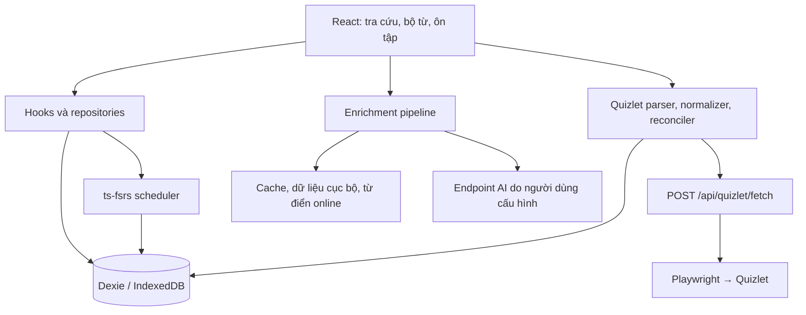

# Kiến trúc và dữ liệu

[← README](../README.md)

LexiPulse là ứng dụng React. `App.tsx` điều phối tra cứu, bộ từ và ôn tập; service xử lý nội dung; Dexie quản lý dữ liệu cá nhân trong IndexedDB.

## Ranh giới chính

| Vùng | Vai trò |
| --- | --- |
| `src/features/` | Màn hình chức năng, dùng component và hook. |
| `src/components/` | Giao diện, tương tác và phím tắt. |
| `src/services/enrichmentPipeline.ts` | Phối hợp từ điển, lemma và AI. |
| `src/services/dictionary/` | Adapter, cache và circuit breaker. |
| `src/services/vocabRepository.ts` | Cập nhật từ, giữ tiến độ và metadata người dùng. |
| `src/services/fsrs/` | Chuyển đổi trạng thái thẻ, tính lịch và preview. |
| `src/services/quizlet/` | URL/export, chuẩn hóa, từ trùng, migration và quản lý bộ. |
| `src/services/db/` | Schema, migration, cài đặt, thống kê và import/export. |
| `server/` | HTTP backend tùy chọn và đọc Quizlet. |
| `vite.config.ts` | Middleware API dev/preview; không nằm trong frontend tĩnh. |

## Lưu trữ và nâng cấp

Schema nằm trong `src/services/db/schema.ts`. Mỗi từ gồm nội dung, nguồn, tag, ghi chú và `reviewMeta`. FSRS chuyển đổi timestamp qua service riêng để serialize được.

Thống kê ngày, settings và bộ Quizlet nằm ở bảng riêng. Migration phải xử lý database đã tồn tại khi người dùng nâng cấp frontend. Test kiểm tra migration, bảo toàn lịch sử và cập nhật/import nhất quán.

Backup envelope phiên bản 1 có `type`, `version`, `exportedAt`, `words`, `settings`, `dailyStats`. API key được bỏ khỏi settings. Bảng bộ Quizlet chưa nằm trong envelope, nên backup chưa là bản sao mọi bảng.

## Mạng và offline

Tra cứu có thể lấy cache/cục bộ trước khi bổ sung nội dung. AI gọi trực tiếp endpoint đã cấu hình. Adapter dịch thử endpoint cùng origin và các nguồn ngoài theo điều kiện chạy.

Văn bản Quizlet được phân tích trong trình duyệt; nhập URL gọi backend mở Chromium và đọc trang. Khả năng hoạt động phụ thuộc cấu trúc và quyền truy cập trang.

Service worker trong `public/sw.js` cache app shell/tài nguyên đã tải, bỏ qua `/api/` và một số endpoint nhạy cảm. Chưa có đồng bộ cloud; cache không bảo đảm mọi màn hình/dữ liệu từ xa dùng được offline.

## Kiểm thử

Vitest kiểm tra parser, dịch/AI, migration, import/export, repository, FSRS, phím tắt và UI. Playwright chạy trên bản build với Chromium. CI cài từ lockfile, lint, typecheck, unit test, build và E2E.

Test với nguồn mô phỏng không bảo đảm provider AI hoặc Quizlet online luôn khả dụng. Xem [triển khai](deployment.md) về frontend tĩnh và định tuyến backend.
